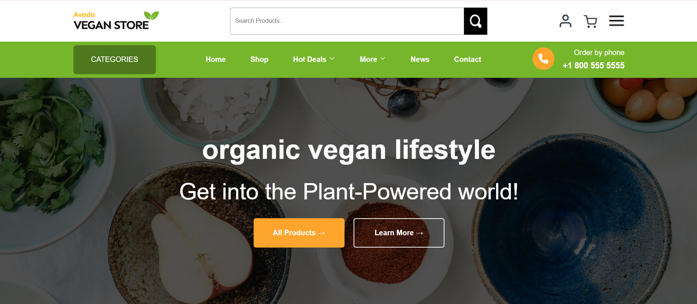
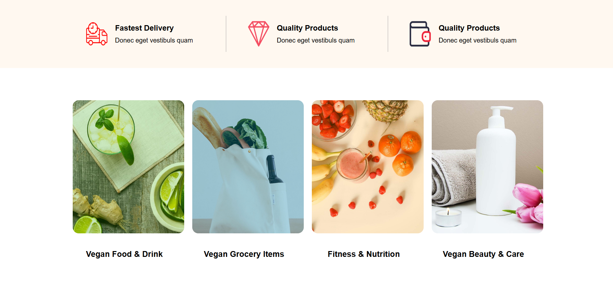

# 🌿 Vegan Store - Landing Page

A simple and responsive landing page built with HTML5 and CSS3.  
This project focuses on clean UI design, semantic structure, and basic front-end development.

---

## 🚀 Live Demo

👉 [View Live Site](https://elhamnosani.github.io/vegan-store/)

---

## 📸 Preview


---

## ✨ Features

- Clean and modern UI layout  
- Built with HTML5 semantic structure  
- Styled using pure CSS3  
---

## 🛠️ Technologies Used

- HTML5  
- CSS3  

---

## 🎯 Purpose of the Project

This project was created to practice:

- HTML structure and semantic tags  
- CSS styling and layout techniques    

---

## ⚙️ How to Run Locally

```bash
git clone https://github.com/elhamnosani/vegan-store.git
cd vegan-store
open index.html
